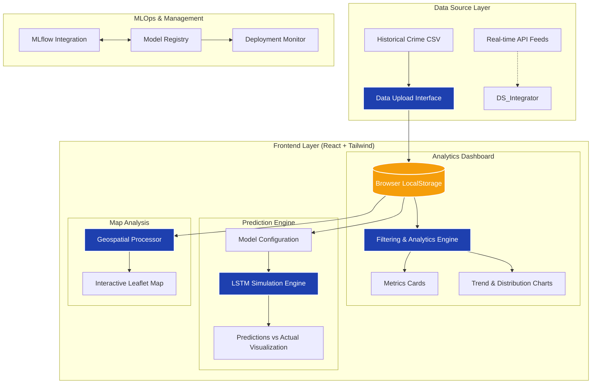

# Project Architecture: CrimePredictPro

This diagram illustrates the end-to-end data flow and architectural components of the CrimePredictPro analytics platform.

## Architectural Flow Summary

1.  **Ingestion**: Users upload historical crime datasets (CSV) which are parsed and persisted in **LocalStorage** for high-performance client-side access.
2.  **Processing**: A centralized **Analytics Engine** handles complex filtering (Date, Region, Crime Type) and calculates real-time metrics (Clearance Rates, Response Times).
3.  **Visualization**:
    *   **Dashboard**: Recharts-powered interactive trends and pie charts.
    *   **Geospatial**: Leaflet-powered heatmap and cluster analysis.
4.  **Prediction**: An **LSTM Simulation Engine** uses seeded random algorithms to project future crime trends based on selected historical windows and crime metrics.
5.  **MLOps**: The **Model Management** module integrates with simulated MLflow servers to track experiments, register production-ready models, and monitor deployments.
